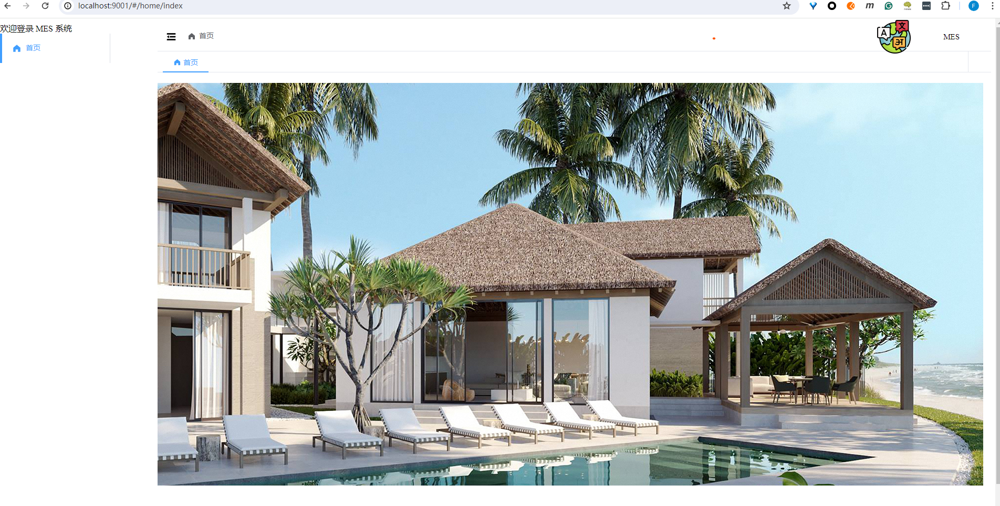

### window-door-mes-ui-vue
* Prerequisites
- 1. Install nodejs https://nodejs.org/en/download/current
- 2. Node version > 20, npm version > 10 LTS version recommended
    ```text
    Copy code
        "node": ">=20.11.1",
        "npm": ">=10.2.4"
    ```
- 3. Recommended: Visual Studio Code or any other preferred IDE.
- 4. Why choose TS (TypeScript):
    - 1. TypeScript (TS) is mostly compatible with JavaScript (JS).
    - 2. TypeScript is not a dynamically typed language, making development more reliable.


### Develop
#### 1 Install
    ```shell
    npm install
    ```
#### 2 Compile and hot-reload for development
    ```shell
    npm run lint
    ```
#### 3 Custom Configuration
- 1. Development environment configuration: .env.development
- 2. Staging environment configuration: .env.staging

    ```
    VUE_APP_ENABLE_MOCK=true
    VUE_APP_DEV_PORT=9001
    ```
#### 4 Development Guidelines




Structure
```
├── src
│ ├── api # API interfaces, AJAX, etc.
│ ├── assets # Local static resources
│ ├── locals # Internationalization
│ ├── components # Business common components
│ ├── layout # Layout
│ ├── theme # CSS theme styles
│ ├── router # Router
│ ├── store # Vuex
│ ├── utils # Utility library
│ ├── views # Business page entry and common templates
│ ├── App.vue # Vue template entry
│ └── main.ts # Vue entry ts
├── README.md
├── mock # Backend mock data for debugging development
├── .env # Environment variables
└── package.json    
```

- Run this server on your local computer.
- Simulate all data.
- Write unit tests or test cases.
- Push the code for review.
### Mock Server DEV Debugging
* 1. Edit the files under mock, and start testing the mock server. You can use Postman or a Python script for testing.
    ```
    npm run start-mock
    ```
* 2. Edit the environment variables for mock in mock_env.json.
* 3. Debug the frontend code:
    ```npm run dev ```
