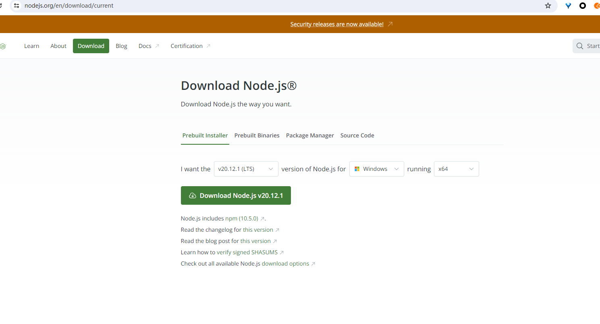
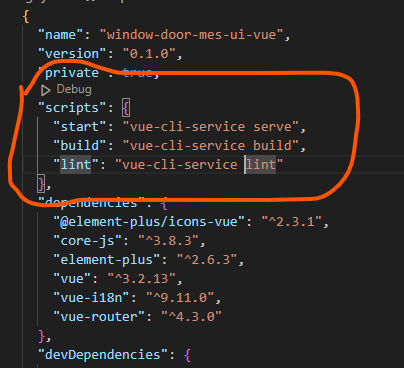
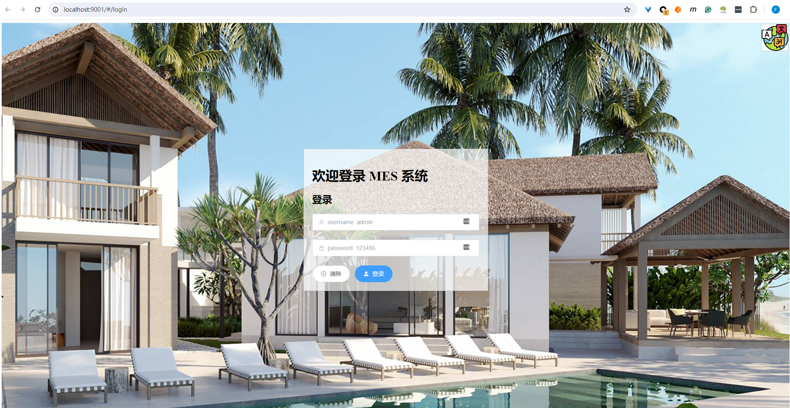
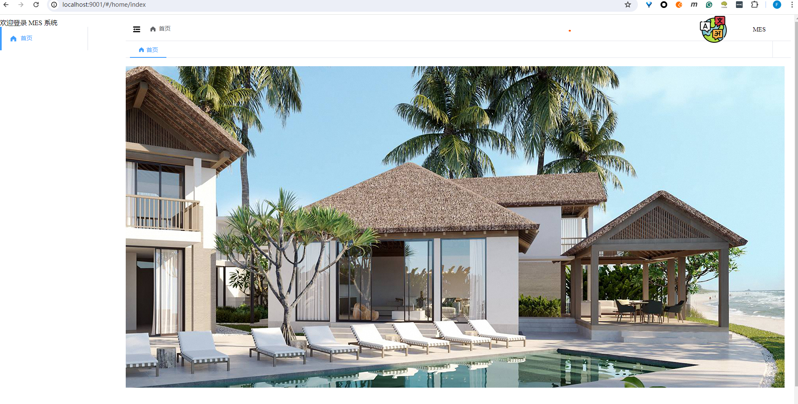

# window-door-mes-ui-vue

## 预备安装
* 1. nodejs [https://nodejs.org/en/download/current](https://nodejs.org/en/download/current)
* 2. node > 20 npm > 10 **推荐LTS 版本**
    ```text
        "node": ">=20.11.1",
        "npm": ">=10.2.4"
    ```
    

* 3. vs code 推荐 或者其他顺手的ide

* 4. 为什么选择TS：
    * 1. TS 和 JS 基本一致 
    * 2. TS 不是动态语言 开发更可靠


## 项目演示


## 项目设置


```shell
npm install
```


### 编译并在开发环境中进行热重载
```shell
npm run dev
```

### Lints 和修复文件
```shell
npm run lint
```

### 自定义配置
- 开发环境配置: .env.development
- 演示环境配置: .env.staging
- 生产环境配置: .env

	```
	VUE_APP_ENABLE_MOCK=true
	VUE_APP_DEV_PORT=9001
	```
### 开发规则






---
结构 
---
```

├── src
│ ├── api # API接口 ajax 等
│ ├── assets # 本地静态资源
│ ├── locals # 国际化
│ ├── components # 业务通用组件
│ ├── layout # 布局
│ ├── theme # CSS主题样式
│ ├── router # 路由
│ ├── store # Vuex
│ ├── utils # 工具库
│ ├── views # 业务页面入口和常用模板
│ ├── App.vue # Vue 模板入口
│ └── main.ts # Vue 入口 ts
├── README.md
├── mock # 后端模拟数据，便于调试开发
├── .env # 环境变量
└── package.json

```

- 在本地计算机上运行此服务器
- 模拟所有数据
- 编写单元测试或测试用例
- 将代码推送到审核

### Mock Server DEV 开发调试
- 1. 编辑mock下的文件, 并开始测试mock服务器 可以使用postman或者 用python 脚本来进行测试
   ```shell
   npm run start-mock
   ```

- 2. mock的环境变量 请编辑 **mock_env.json**

- 3. 调试前端代码
   ```shell
   npm start 
   ```

   ```shell
   npm run start 
   ```
   会自动启动 mock server 然后再启动 前端代码
